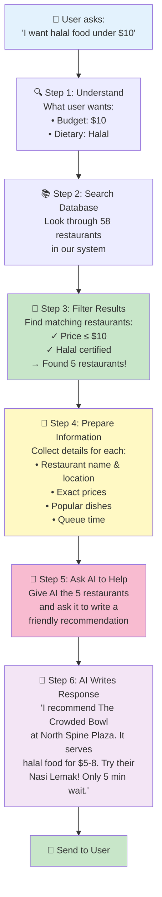
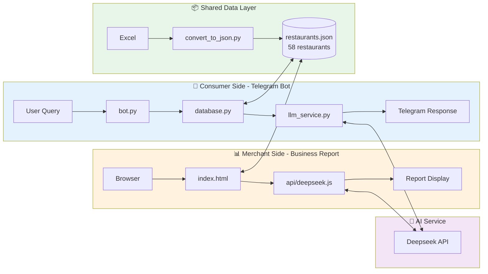
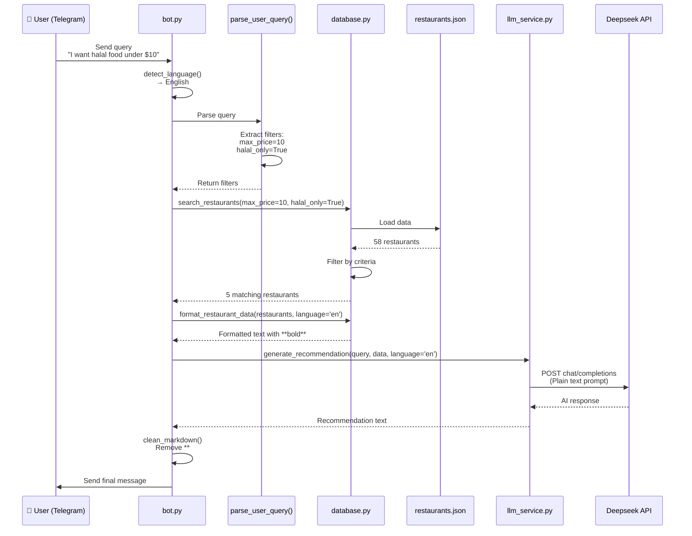
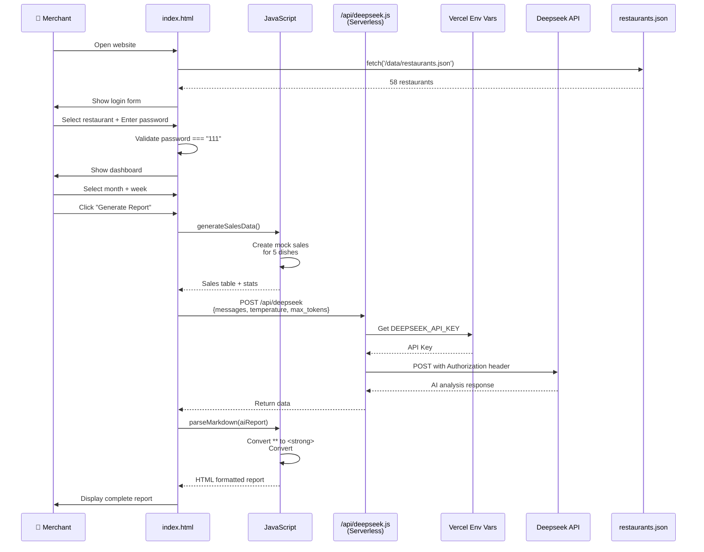
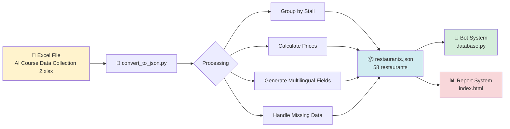
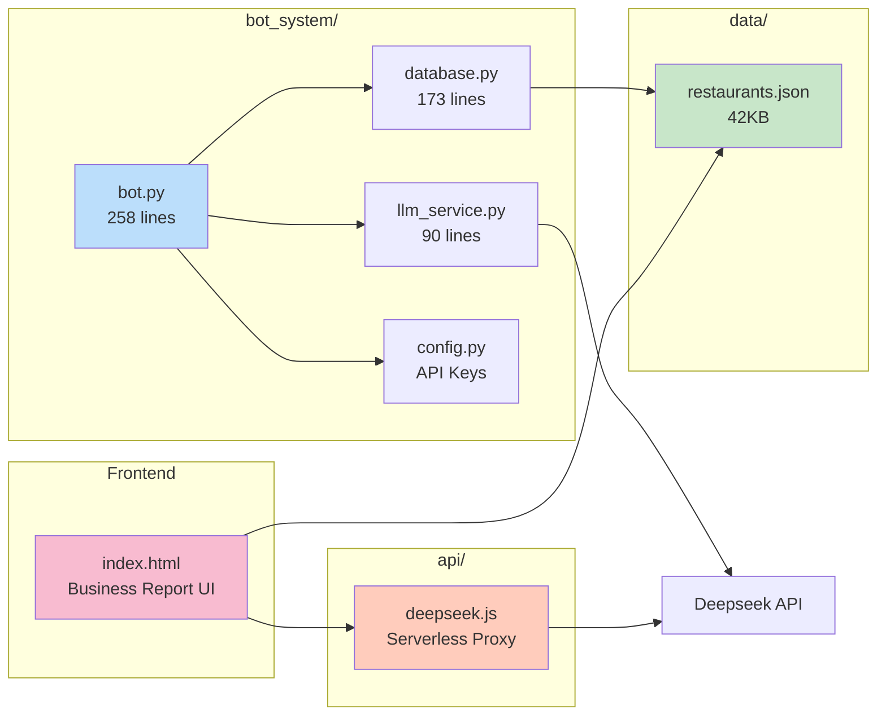

# 🎯 GP8000 - Smart Restaurant Recommendation & Business Report System

This project contains two independent intelligent systems serving both consumers and merchants.

---

## 🚀 Quick Start

### 📱 Telegram Bot (Consumer Side)

```bash
cd bot_system
python3 bot.py
```

### 📊 Business Report System (Merchant Side)

**Local Development:**
```bash
cd Vendor
./start_report_server.sh
# Visit http://localhost:8000/Vendor/business_report.html
```

**Deploy to Vercel:**
```bash
# See docs/QUICK_DEPLOY.md
```

---

## 📂 Project Structure

```
GP8000/
├── index.html                   # 🌐 Website Homepage (Business Report System)
├── package.json                 # 📦 Node.js Config (Required for Vercel)
├── vercel.json                  # ⚙️  Vercel Configuration
├── requirements.txt             # 🐍 Python Dependencies
├── README.md                    # 📖 Chinese Version
├── README_EN.md                 # 📖 This File (English Version)
├── .gitignore                   # 🔒 Git Ignore Rules
├── .vercelignore                # 🔒 Vercel Ignore Rules
│
├── 📚 docs/                     # Documentation Directory
│   ├── FEATURES.md              # Feature Documentation (Chinese) ⭐
│   └── FEATURES_EN.md           # Feature Documentation (English) ⭐
│
├── 🤖 bot_system/               # Telegram Bot System
│   ├── bot.py                   # Bot Main Program
│   ├── database.py              # Database Interface
│   ├── llm_service.py           # AI Service
│   ├── config.py                # Configuration (API Keys) ⚠️
│   ├── START_BOT.sh             # Startup Script
│   ├── README.md                # Bot System Guide (Chinese)
│   └── README_EN.md             # Bot System Guide (English)
│
├── 📊 Vendor/                   # Business Report System (Backup)
│   ├── business_report.html     # Report Page
│   ├── start_report_server.sh   # Local Startup Script
│   ├── README.md                # Documentation (English)
│   ├── REPORT_README.md         # Detailed Guide (Chinese)
│   └── REPORT_README_EN.md      # Detailed Guide (English)
│
├── ⚙️  api/                     # Serverless Functions
│   └── deepseek.js              # Deepseek API Proxy (Hides API Key)
│
└── 📦 data/                     # Data Files
    ├── restaurants.json         # 58 Restaurant Data (Main Data Source)
    ├── AI Course Data Collection 2.xlsx # Raw Excel Data
    ├── convert_to_json.py       # Excel → JSON Converter
    ├── README.md                # Data Documentation (Chinese)
    └── README_EN.md             # Data Documentation (English)
```

**Note**: 
- `index.html` is in the root directory as the website homepage, directly displaying the business report system
- `config.py` contains API Keys, protected by `.gitignore`
- `package.json` is essential for Vercel deployment

---

## 📖 Documentation Navigator

| Document | Purpose | Priority |
|----------|---------|----------|
| [FEATURES.md](docs/FEATURES.md) | Detailed Features (Chinese) | ⭐⭐⭐⭐⭐ |
| [FEATURES_EN.md](docs/FEATURES_EN.md) | Detailed Features (English) | ⭐⭐⭐⭐⭐ |
| [README_EN.md](README_EN.md) | This File | ⭐⭐⭐⭐⭐ |

---

## 🎯 Two Systems

### 🤖 System 1: Telegram Restaurant Recommendation Bot

**Target Users**: Students, Faculty, Visitors

**Core Features**:
- ✅ Smart Restaurant Recommendations (AI-Powered)
- ✅ Bilingual Support (Chinese & English)
- ✅ Multi-Dimensional Filtering (Price, Cuisine, Halal, Vegetarian)
- ✅ Real-Time Queue Time
- ✅ Based on 58 Restaurant Database

**Query Examples**:
```
"I want halal food under 10 dollars"
"推荐不辣的餐厅，预算15块"
```

### 📊 System 2: Business Report System

**Target Users**: Restaurant Owners, Managers

**Core Features**:
- ✅ Password-Protected Login
- ✅ Periodic Report Generation (By Month/Week)
- ✅ Sales Data Visualization
- ✅ AI Strategic Analysis
- ✅ Markdown Format Reports

**Highlights**:
- Full Year 2025 Data
- Real-Time Data Refresh
- Professional Business Reports
- Secure Deployment (API Key Hidden)

---

## 💻 Tech Stack

| Component | Technology |
|-----------|------------|
| **Bot Backend** | Python 3.10+, python-telegram-bot |
| **AI Service** | Deepseek API |
| **Data Processing** | Pandas, JSON |
| **Frontend** | HTML5, CSS3, JavaScript |
| **Backend API** | Vercel Serverless Functions |
| **Deployment** | Vercel (Recommended), GitHub Pages |

---

## 📊 System Architecture & Code Flow

### RAG (Retrieval-Augmented Generation) - How It Works

**What is RAG?**  
Think of RAG as a smart librarian + writer combo:
- 📚 **Librarian (Retrieval)**: First, find relevant books (restaurant data)
- ✍️ **Writer (Generation)**: Then, write a personalized answer using those books

**Why RAG?**  
Without RAG, AI might "hallucinate" - recommend restaurants that don't exist or get prices wrong.  
With RAG, AI only recommends from **real, filtered data** = accurate & reliable! ✅

---



**The Magic of RAG in 3 Simple Steps:**

1️⃣ **FIND** (Retrieval)  
   User says: "halal food under $10"  
   System searches: 58 restaurants → filters → finds 5 matches

2️⃣ **GIVE** (Context)  
   System gives AI these 5 real restaurants with all their details

3️⃣ **WRITE** (Generation)  
   AI writes a natural, friendly recommendation using ONLY those 5 restaurants

**Result:** Accurate, personalized, trustworthy recommendations! 🎯

---

**Why This Matters:**

| Without RAG ❌ | With RAG ✅ |
|----------------|-------------|
| AI might recommend "ABC Restaurant" that doesn't exist | AI only recommends from 58 real restaurants |
| Price might be wrong: "$5" but actually $15 | Exact prices from database: "$5-8" |
| "Not spicy" but actually very spicy | Filtered by actual criteria |
| Generic answer for everyone | Personalized based on YOUR requirements |

---

### Overall System Architecture



### Telegram Bot Detailed Flow



### Business Report System Detailed Flow



### Data Update Flow



### Key Components Interaction



---

## 📦 Install Dependencies

```bash
pip install -r requirements.txt
```

Dependencies:
- `python-telegram-bot==20.7`
- `openai==1.12.0`
- `pandas==2.0.3`
- `openpyxl==3.1.2`

---

## 🔑 Configuration

Create `bot_system/config.py`:

```python
# Telegram Bot Token (Get from @BotFather)
TELEGRAM_BOT_TOKEN = "your_telegram_bot_token"

# Deepseek API Key
DEEPSEEK_API_KEY = "your_deepseek_api_key"
```

---

## 🚀 Deployment

### Local Development

1. **Start Telegram Bot**:
   ```bash
   cd bot_system
   python3 bot.py
   ```

2. **Start Business Report**:
   ```bash
   cd Vendor
   python3 -m http.server 8000
   ```

### Production Deployment

**Recommended: Vercel (Free + Secure)**

See: [docs/FEATURES_EN.md](docs/FEATURES_EN.md)

---

## 📊 Data Overview

- **Total Restaurants**: 58
- **Menu Items**: 163
- **Price Range**: $1 - $30
- **Locations**: Multiple campus canteens and food courts
- **Features**: Halal, Vegetarian options marked

### Update Data

```bash
cd data
# 1. Replace Excel file
# 2. Run conversion
python3 convert_to_json.py
```

---

## 🔒 Security

- ✅ API Keys not in frontend code
- ✅ Environment variables for secrets
- ✅ Serverless Functions proxy API calls
- ✅ Password-protected business reports
- ✅ .gitignore protects sensitive files

---

## 📞 Support

- 📖 Documentation: [docs/FEATURES_EN.md](docs/FEATURES_EN.md)
- 🤖 Bot Guide: [bot_system/README_EN.md](bot_system/README_EN.md)
- 📊 Report Guide: [Vendor/README.md](Vendor/README.md)

---

## 📄 License

MIT License

---

**Last Updated**: October 17, 2025  
**Version**: v2.0  
**Data Version**: 58 Restaurants, 163 Menu Items

